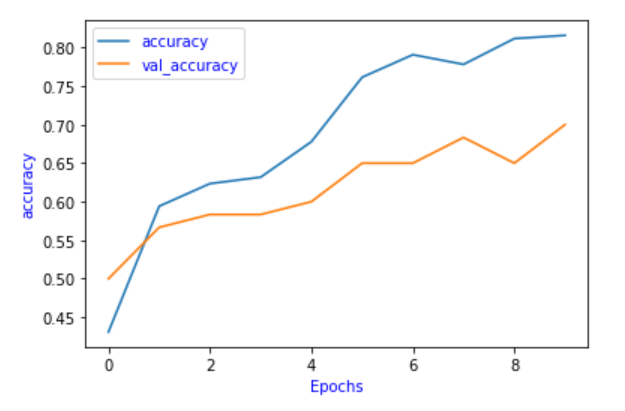
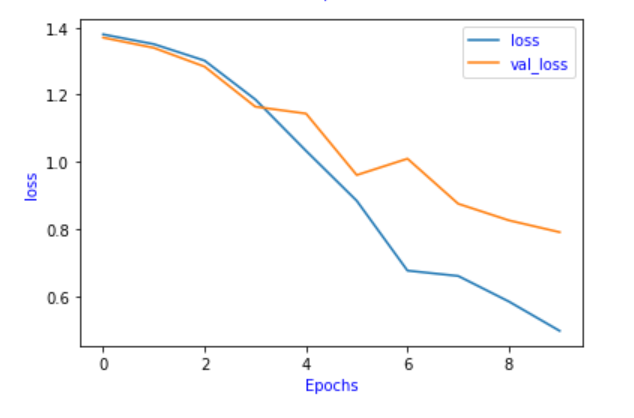

# Indy-Archieve-Document-Classification

# Problem Statement
Document classification is a problem faced by many organizations globally. As documents increase in volume, their capacity to be stored multiplies and manual document annotation has become expensive, unscalable, and impractical. To rectify this problem, data scientists now employ many modes of algorithms with the goal of classifying these documents automatically.

Indianapolis is also not immune to this problem, and thus this project began in collaboration with The Polis Center of Indianapolis in order to solve this very problem: “How can we classify large numbers of text articles from the Encyclopedia of Indianapolis based on subject?”. 

The Encyclopedia of Indianapolis contains thousands of entries ranging from the subjects of bibliographic timepieces of influential individuals, to descriptive geography, and centuries of recorded events - all of which are currently unlabeled.

# Goal of this project
The goal of this project is to automate the document classification process by building a predictive model to classify them into categories of geography, time, person, and organization.

This categorization will facilitate archival and search of articles for years to come and get rid of the mundane tasks of reading and annotating articles manually.

# Why Deep Learning?
With the increase in corpus size, automation in classification is much needed. This is reason why deep learning algorithms out-perform other techniques if the data size is large.

Deep Learning typically requires a large quantity of training data to ensure that the network, which may very well have tens of millions of parameters and does not overfit the training data.

In this project, I used a deep neural network which employs a Bidirectional Long-Short-Term Memory network (Bi-LSTM) to classify Encyclopedia of Indianapolis articles.

# Data Source
Data for this project was generously provided by The Polis Center of Indianapolis. It consisted of roughly 1,600 plain-text articles in JSON format. A data frame was first made available through API and transformed in Python. It was then converted into a CSV format for further processing in Pandas.

The dataset contains the following features:
Body: The body of the document which contained the document’s content.
Category: The category to which the document belongs.

Label categories were classified as one of the following: “time”, “person”, “organization”, and “geography”,
Where “time” consisted of articles primarily describing years, dates, or eras. 
“Person” consisted of articles describing specific or small groups of individuals. 
“Organization” consisted of articles describing businesses, non-profits, not-for-profit, clubs, etc.
“Geography” consisted or articles describing developments, cities, towns, and land.

# Data Pre-Processing
1.	Dropping the duplicate rows:
For safety, any duplicate entries or missing values from the dataset were removed. 

2.	Removing the special characters from articles:
Punctuation was also removed using regular expression in Python, and type-case was lowered.

3.	Removed “run-on” words from articles: 
Upon inspecting the data, it became apparent that one additional step was necessary, which included filtering words longer than 15 characters. This was necessary due to articles which contained accidental “run-on” words, such as in the following example:
wasanextracurricularorganizationthatprepared 

One solution to this problem which should be considered is an algorithm which divides these words based on plausible spacing positions, however the implementation of this method falls outside of the scope of our research and can be taken a future to-do.
For this project, these words were removed from the dataset all-together. 

# Exploratory Data Analysis
1.	Distribution of different categories in the dataset.
The distribution of categories in the dataset was not uniform, which resulted in a larger number of articles about people and organizations, rather than time or geography.

2.	Finding the number of words in each document.
Articles ranged from a few sentences to several paragraphs, with a mean length of 380 words. Percent of articles greater than 380 words.

# Load and Prepare data for Modelling:
1.	Splitting the data:
There are labelled 300 articles in the sample data, it was split into training set and validation set into 80 and 20 percent, respectively. 

2.	Tokenizing the words:
Tokenizer does all the heavy lifting for us. In the articles, it will take 5,000 most common words. oov_token is to put a special value in when an unseen word is encountered.

We can see that “<OOV>” is the most common token in our corpus, followed by “said”, followed by “mr” and so on.

After tokenization, the next step is to turn those tokens into lists of sequence. The following is the 1st article in the training data that has been turned into sequences.

3.	Padding:
When we train neural networks for NLP, we need sequences to be in the same size, that is why we use padding. If you look up, our max_length is 200, so we use pad_sequences to make all our articles the same length which is 200. As a result, you will see that the 1st article was 426 in length, it becomes 200, the 2nd article was 192 in length, it becomes 200, and so on.

4.	Tokenize the labels:
Now we are going to look at the labels. Because our labels are text, so we will tokenize them, when training, labels are expected to be numpy arrays. So, we will turn list of labels into numpy arrays

# Model Building:
Indy Archive consists of a Bi-Directional LSTM model implemented in Tensorflow and Keras which predicts the most likely category of each article. 

1.	Sequential Model: 
We build a tf.keras.Sequential() model and start with an embedding layer. An embedding layer stores one vector per word. When called, it converts the sequences of word indices into sequences of vectors. After training, words with similar meanings often have the similar vectors.

2.	Bi-directional LSTM Layer:
The Bidirectional wrapper is used with a LSTM layer, this propagates the input forwards and backwards through the LSTM layer and then concatenates the outputs. This helps LSTM to learn long term dependencies. We then fit it to a dense neural network to do classification.

3.	Dense Layer:
A Dense layer with 4 units and SoftMax activation was added. When we have multiple outputs, SoftMax converts outputs layers into a probability distribution.

4.	Activation Function:
The ‘relu’ activation function was used in place of tahn function since they are very good alternatives of each other.

In the model summary, we have the embeddings, the Bidirectional layer which contains LSTM, followed by two dense layers. The output from Bidirectional is 128, because it doubled what we put in LSTM. 

There are 4 labels in total, but because they are not one-hot encode labels, there is a need to use sparse_categorical_crossentropy as loss function, it seems to think 0 is a possible label as well, while the tokenizer object which tokenizes starting with integer 1, instead of integer 0. 
As a result, the last Dense layer needs outputs for labels 0, 1, 2, 3, 4 although 0 has never been used.

# Hyper-Parameter Tuning:
Vocab_size is the maximum number of unique words considered in the model.
oov_token is to put a special value in when an unseen word is encountered. This means we want <OOV> to be used for words that are not in the word_index.
Max_length is the maximum number of words (or words to pad) a document.
Embedding_dim is the length of the embedded vector which represents the document.
  
The best combination that worked after trying different variations of hyper-parameters is:

# Results:
The network described in methodologies performed with 70% accuracy. This result is not as high as anticipated, but this work can achieve greater results. This has largely to do with the way in which our data was annotated, and the multi-class flexibility of most entries.

Loss

Classification Report

# Future Improvements:
As an ongoing project, this model will continually improve as the data keeps coming in. It would be entirely plausible that this model is fine-tuned and replaces its results periodically as improvements become available. 
Approaches from semi-supervised learning models may also be capable of introducing higher accuracy and fewer necessary annotations. 
Neural architectures are rapidly improving and require only time to solve. Results in the field of Natural Language Processing will yield improved accuracy and results in text classification and generation for years to come. 

